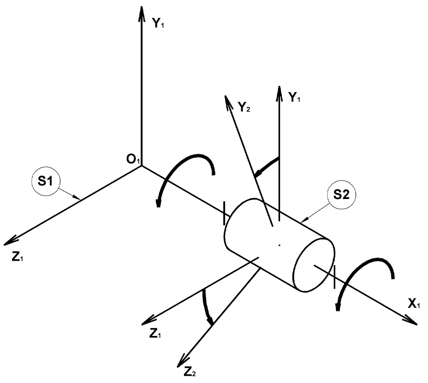

## Etude du comportement dynamique d'un solide en rotation autour d'un axe fixe

### Aspects cinématiques

#### Paramétrage du modèle pivot

{.center width=60%}

#### Equations horaires du mouvement uniforme

...

...

...

#### Equations horaires du mouvement uniformément varié

...

...

...

...

??? example "Application de cours : **Etude du comportement dynamique d’un treuil**"

    {.center width=50%}

    La figure ci-dessus représente un treuil. Un moto réducteur, non représenté, entraîne en rotation le tambour 1, sur lequel s’enroule le câble 2 et permet ainsi de lever la charge 3.    

    La charge de masse $m = 10 kg$ est soulevée en trois phases décrites par le graphe des vitesses ci-dessous :

    {.center width=60%}

    Le tambour est un cylindre plein en liaison pivot avec le bâti (non représenté). La masse du câble est négligée, donc la tension déterminée à la première partie est constante tout le long du câble. Le couple résistant dans la liaison pivot est négligé.
    
    On donne :

    - le moment d’inertie pour un cylindre plein est : $J = {1 \over 2} \times m \times r^2$
    - la masse du tambour est : $m_1 = 5 kg$
    - le rayon du tambour est : $r_1 = 150 mm$
    
    On demande :

    - Déterminer les vitesses et accélérations angulaires du tambour dans son mouvement par rapport au bâti pour chacune des trois phases.

### Principe fondamental de la dynamique

???+ abstract "Théorème de la résultante dynamique"

    La  somme  vectorielle  des  actions  mécaniques  extérieures  appliquées  à  un  solide  $S$  en  mouvement  de  rotation autour d’un axe fixe par rapport à un repère absolu $R = (O, \overrightarrow{x}, \overrightarrow{y}, \overrightarrow{z})$ est nulle.

    ...

    Unités :

???+ abstract "Théorème du moment dynamique résultant"

    La somme vectorielle des moments des actions mécaniques extérieures appliquées à un solide $S$ en mouvement de rotation autour d’un axe fixe par rapport à un repère absolu $R = (O, \overrightarrow{x}, \overrightarrow{y}, \overrightarrow{z})$ est égale au produit du moment d’inertie de ce solide par son accélération angulaire.

    ...

    ...

    Unités :

    !!! note "Moment d'inertie"
        Le moment d’inertie $J$ exprime la répartition des masses autour de l’axe de rotation ;  Unité : $m^2 \cdot kg$

        ???- example "Un patineur sur glace tourne plus vite sur lui-même quand il serre ses bras contre son corps que quand il les écarte."
            Isolons le patineur.

            Bilan des forces extérieures :

            - poids du patineur
            - action de la glace sur les patins
            
            Théorème du moment dynamique :

             $0 = J \times α \Rightarrow J \times ω = constante$

            - si ω augmente alors J diminue (bras serrés)
            - si ω diminue alors J augmente (bras écartés)

   
??? example "Application de cours : **Etude du comportement dynamique d’un treuil**"

    {.center width=50%}

    La figure ci-dessus représente un treuil. Un moto réducteur, non représenté, entraîne en rotation le tambour 1, sur lequel s’enroule le câble 2 et permet ainsi de lever la charge 3.    

    La charge de masse $m = 10 kg$ est soulevée en trois phases décrites par le graphe des vitesses ci-dessous :

    {.center width=60%}

    Le tambour est un cylindre plein en liaison pivot avec le bâti (non représenté). La masse du câble est négligée, donc la tension déterminée à la première partie est constante tout le long du câble. Le couple résistant dans la liaison pivot est négligé.
        
    On donne :

    - le moment d’inertie pour un cylindre plein est : $J = {1 \over 2} \times m \times r^2$
    - la masse du tambour est : $m_1 = 5 kg$
    - le rayon du tambour est : $r_1 = 150 mm$
        
    On demande :

    - Isoler le tambour et déterminer le couple exercé par le moto réducteur sur ce tambour durant la première phase (on prendra une intensité de $120 N$ pour la tension dans le câble quelque soit le résultat trouvé précédemment).
    - Le choix de la première phase pour déterminer ce couple vous semble-t-il judicieux ? Justifier...

### Aspect énergétique

#### Energie cinétique d'un solide en translation

$$E_c = {1 \over 2} \times m \times v^2$$

- $E_c$ : Énergie cinétique de translation ($J$)
- $m$ : Masse de l’objet (inertie de translation) ($kg$)
- $v$ : Vitesse de l’objet ($m \cdot s^{-1}$)

 

#### Energie cinétique d'un solide en rotation autour d'un axe fixe

$$E_c = {1 \over 2} \times J \times \omega^2$$

- $E_c$ : Énergie cinétique de l’objet en rotation ($J$)
- $J$ : Inertie de l’objet autour de l'axe de rotation ($m^2 \cdot kg$)
- $\omega$ : Vitesse angulaire ($rad \cdot s^{-1}$)

??? example "Complément : **Etude énergétique treuil**"

    {.center width=50%}

    La figure ci-dessus représente un treuil. Un moto réducteur, non représenté, entraîne en rotation le tambour 1, sur lequel s’enroule le câble 2 et permet ainsi de lever la charge 3.    

    La charge de masse $m = 10 kg$ est soulevée en trois phases décrites par le graphe des vitesses ci-dessous :

    {.center width=60%}

    Le tambour est un cylindre plein en liaison pivot avec le bâti (non représenté). La masse du câble est négligée, donc la tension déterminée à la première partie est constante tout le long du câble. Le couple résistant dans la liaison pivot est négligé.
    
    On donne :

    - le moment d’inertie pour un cylindre plein est : $J = {1 \over 2} \times m \times r^2$
    - la masse du tambour est : $m_1 = 5 kg$
    - le rayon du tambour est : $r_1 = 150 mm$
    - le rendement du réducteur est : $η = 0,9$ ;
    - le rapport de réduction du réducteur est : $r = \frac{1}{12}$ ;

    On demande :

    - Calculer les énergies cinétiques de la charge 3 et du tambour 1 pendant la deuxième phase ;
    - Déterminer alors la vitesse de rotation du moteur ;
    - Déterminer le couple maximal que le moteur doit fournir pendant la première phase (on prendra un couple exercé par le moto réducteur sur le tambour de $18,75 {N \cdot m}$ quelque soit le résultat trouvé précédemment) ;
    - Déterminer la puissance maximale que le moteur doit fournir.