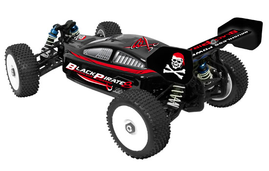
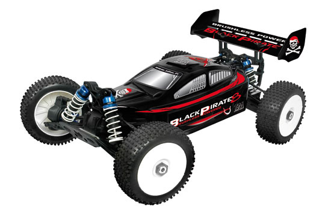
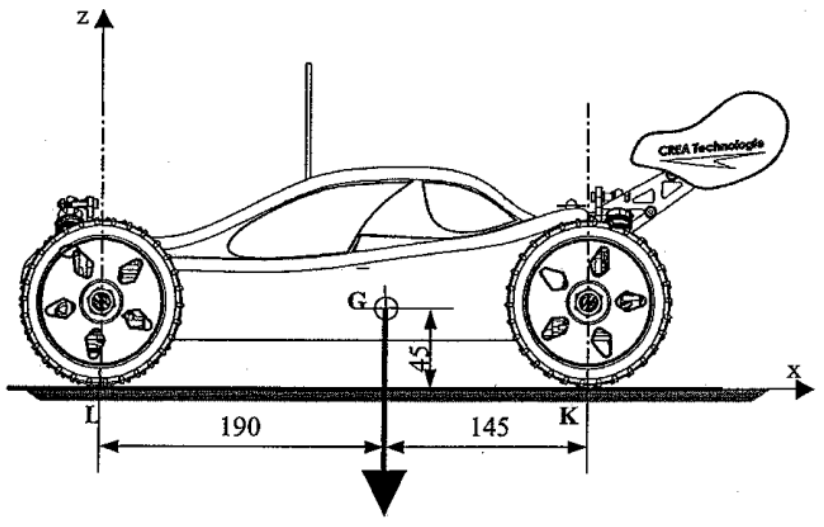

## Etude du comportement dynamique d'un solide en translation rectiligne

### Aspects cinématiques

#### Paramétrage du modèle glissière

{.center width=60%}

#### Equations horaires du mouvement uniforme

...

...

...

#### Equations horaires du mouvement uniformément varié

...

...

...

...

??? example "Application de cours : **Etude du comportement dynamique d’un treuil**"

    {.center width=50%}

    La figure ci-dessus représente un treuil. Un moto réducteur, non représenté, entraîne en rotation le tambour 1, sur lequel s’enroule le câble 2 et permet ainsi de lever la charge 3.    

    La charge de masse $m = 10 kg$ est soulevée en trois phases décrites par le graphe des vitesses ci-dessous :

    {.center width=60%}

    - Caractériser le mouvement de la charge pour chacune des trois phases.

??? example "Application : **[T2M Buggy Black Pirate](http://www.t2m-rc.fr/de/modellbau-t2m-black-pirate-8-rtr-ohne-akku-T4903.html){target=_blank}**"

    {align=left width=30%}{align=right width=30%}
    
    !!! quote ""        
        Le Black Pirate est un Buggy tout terrain 1/8, 4x4, 3 différentiels, à propulsion électrique Brushless :
        
        - Vitesse maxi : $70 km/h$ environ
        - Accélérations phénoménales : $1,5 \times g$ !!
        - La masse totale du buggy est $m = 3,60 kg$
    
    

    #### Q1) Analyse des performaces annoncées par le constructeur
    
    - Calculer le temps que mettrait le buggy pour atteindre sa vitesse maximale
    
    #### Q2) Comparaison avec les performances relevées sur piste

    Lors d’un essai sur piste de terre, une mesure de vitesse a été effectuée ; Sur une ligne droite, voiture à l’arrêt, nous effectuons une accélération pour atteindre la vitesse maximale, suivi d’un maintien de la vitesse, puis suivi d’un freinage jusqu’à l’arrêt complet.
    {.center width=70%}
    
    - Repérer sur les graphes les différentes phases (étapes) de l’essai effectué ;
    - Relever la valeur de la vitesse maximale atteinte et en déduire l’accélération au démarrage :
    - Comparer avec les performances annoncées.

### Principe fondamental de la dynamique

???+ abstract "Théorème de la résultante dynamique"

    La  somme  vectorielle  des  actions  mécaniques  extérieures  appliquées  à  un  solide  $S$  en  mouvement  de  translation  par rapport à un repère absolu $R = (O, \overrightarrow{x}, \overrightarrow{y}, \overrightarrow{z})$ est égale au produit de la masse de ce solide par l’accélération de son centre de gravité $G$.

    ...

    ...

    ...

    ... Unités :

???+ abstract "Théorème du moment dynamique résultant"

    La somme vectorielle des moments des actions mécaniques extérieures appliquées à un solide $S$ en mouvement de translation par rapport à un repère absolu $R = (O, \overrightarrow{x}, \overrightarrow{y}, \overrightarrow{z})$ est nulle à son centre de gravité G.

    ...

    ...

    ...

    ...
    
    Unités :

    !!! note "Remarque"
        - le théorème du moment implique que la résultante des actions mécaniques extérieures passe par $G$, sinon son moment par rapport à $G$ n’est pas nul.
        - Les cas de l’équilibre statique ou lorsque le mouvement est uniforme sont des cas particuliers de la dynamique (cas où l’accélération est nulle).

??? example "Application de cours : **Etude du comportement dynamique d’un treuil**"

    {.center width=50%}

    La figure ci-dessus représente un treuil. Un moto réducteur, non représenté, entraîne en rotation le tambour 1, sur lequel s’enroule le câble 2 et permet ainsi de lever la charge 3.    

    La charge de masse $m = 10 kg$ est soulevée en trois phases décrites par le graphe des vitesses ci-dessous :

    {.center width=60%}

    - Isoler la charge et déterminer la tension du câble pour chaque phase en considérant l'accélération de la pesanteur $g=10 m/s^2$. 

??? example "Application : **[T2M Buggy Black Pirate](http://www.t2m-rc.fr/de/modellbau-t2m-black-pirate-8-rtr-ohne-akku-T4903.html){target=_blank}**"

    {align=left width=30%}{align=right width=30%}
    
    !!! quote ""        
        Le Black Pirate est un Buggy tout terrain 1/8, 4x4, 3 différentiels, à propulsion électrique Brushless :
        
        - Vitesse maxi : $70 km/h$ environ
        - Accélérations phénoménales : $1,5 \times g$ !!
        - La masse totale du buggy est $m = 3,60 kg$
    
    {.center width=50%}

    #### Q3) Etude du phénomène de « transfert de charge » et détermination du coefficient d’adhérence
    
     

    - Déterminer la répartition de la charge sur les roues arrière et avant lorsque le véhicule accélère ;
    - Qu’en est-il lorsque le véhicule est à vitesse constante ?
    - Déterminer le coefficient d’adhérence nécessaire pour transmettre une telle accélération ;
    - A partir de quelle accélération risque-t-on de cabrer ?
    - Discuter si les phénomènes de transfert de charge et de cabrage sont bénéfiques à la propulsion et/ou à la traction d’un véhicule automobile…

#### BAME sur (S) = le buggy

- $\overrightarrow{P} = - m \times g \cdot \overrightarrow{y} $

- $\overrightarrow{K_{sol \to S}} = -\|\overrightarrow{K_{sol \to S}}\| \times \sin{\alpha} \cdot \overrightarrow{x} + \|\overrightarrow{K_{sol \to S}}\| \times \cos{\alpha} \cdot \overrightarrow{y} $

- $\overrightarrow{L_{sol \to S}} = -\|\overrightarrow{L_{sol \to S}}\| \times \sin{\alpha} \cdot \overrightarrow{x} + \|\overrightarrow{L_{sol \to S}}\| \times \cos{\alpha} \cdot \overrightarrow{y} $
<!-- 
...

...

...

... -->

#### Résultante dynamique : $\sum\overrightarrow{F_{ext \to S}} = m \cdot \overrightarrow{a_G}$

- en projection sur $\overrightarrow{x}$ : $-\|\overrightarrow{K_{sol \to S}}\| \times \sin{\alpha} -\|\overrightarrow{L_{sol \to S}}\| \times \sin{\alpha} = - m \times a_G$ **(1)**

- en projection sur $\overrightarrow{y}$ : $\|\overrightarrow{K_{sol \to S}}\| \times \cos{\alpha} +\|\overrightarrow{L_{sol \to S}}\| \times \cos{\alpha} = m \times g$ **(2)**

<!-- ...

...

...

... -->

#### Moment dynamique résultant en G : $\sum\overrightarrow{M_G(\overrightarrow{F_{ext \to S}})} = \overrightarrow{0}$

- en projection sur $\overrightarrow{y}$ : $ - x_{LG} \times \|\overrightarrow{L_{sol \to S}}\| \times \cos{\alpha} - y_{LG} \times \|\overrightarrow{L_{sol \to S}}\| \times \sin{\alpha} + x_{GK} \times \|\overrightarrow{K_{sol \to S}}\| \times \cos{\alpha} - y_{KG} \times \|\overrightarrow{K_{sol \to S}}\| \times \sin{\alpha} = 0$ **(3)**
<!-- 
...

...

...

... -->

#### Déterminer la répartition de la charge sur les roues arrière et avant lorsque le véhicule accélère ;

**(1)** => $\|\overrightarrow{L_{sol \to S}}\| \times \sin{\alpha} = m \times a_G -\|\overrightarrow{K_{sol \to S}}\| \times \sin{\alpha} $

**(2)** => $\|\overrightarrow{L_{sol \to S}}\| \times \cos{\alpha} = m \times g - \|\overrightarrow{K_{sol \to S}}\| \times \cos{\alpha} $

avec $ x_{LG} = 190 $, $ y_{LG} = 45 $, $ x_{GK} = 145 $, $ y_{KG} = 45 $ 

**(3)** => $ - 190 \times (m \times g - \|\overrightarrow{K_{sol \to S}}\| \times \cos{\alpha}) - 45 \times (m \times a_G -\|\overrightarrow{K_{sol \to S}}\| \times \sin{\alpha}) + 145 \times \|\overrightarrow{K_{sol \to S}}\| \times \cos{\alpha} - 45 \times \|\overrightarrow{K_{sol \to S}}\| \times \sin{\alpha} = 0$

$ - 190 \times m \times g + 190 \times \|\overrightarrow{K_{sol \to S}}\| \times \cos{\alpha} - 45 \times m \times a_G + 45 \times \|\overrightarrow{K_{sol \to S}}\| \times \sin{\alpha} + 145 \times \|\overrightarrow{K_{sol \to S}}\| \times \cos{\alpha} - 45 \times \|\overrightarrow{K_{sol \to S}}\| \times \sin{\alpha} = 0$

$ 335 \times \|\overrightarrow{K_{sol \to S}}\| \times \cos{\alpha}  = 190 \times m \times g + 45 \times m \times a_G$

$\overrightarrow{K_{sol \to S}} \cdot \overrightarrow{y} = \|\overrightarrow{K_{sol \to S}}\| \times \cos{\alpha} =  {190 \times m \times g + 45 \times m \times a_G \over 335}$

alors **(2)** => $\overrightarrow{L_{sol \to S}} \cdot \overrightarrow{y} = \|\overrightarrow{L_{sol \to S}}\| \times \cos{\alpha} =  {(335-190) \times m \times g - 45 \times m \times a_G \over 335}$

Pour $a_G = 1,5 \times g$, on obtient la répartition de la charge en calculant les composantes verticales des actions mécaniques du sol sur chaque roue en K et en L

$\overrightarrow{K_{sol \to S}} \cdot \overrightarrow{y} =  {3,6 \times (190 \times g + 45 \times 1,5 \times g) \over 335} = {3,6 \times 9,81 \times 257,5 \over 335} = 27,15 \;\mathrm{N}$

$\overrightarrow{L_{sol \to S}} \cdot \overrightarrow{y} =  {3,6 \times (145 \times g - 45 \times 1,5 \times g) \over 335} = {3,6 \times 9,81 \times 77,5 \over 335} = 8,17 \;\mathrm{N}$
<!-- 
...

...

...

... -->

***

#### Qu’en est-il lorsque le véhicule est à vitesse constante ?

Si $a_G = 0$ alors

(1) => $-\|\overrightarrow{K_{sol \to S}}\| \times \sin{\alpha} -\|\overrightarrow{L_{sol \to S}}\| \times \sin{\alpha} = 0$

donc $\sin{\alpha} = 0$ et $\cos{\alpha} = 1$

On retrouve la même répartition que lorsque le véhicule est à l'arrêt

$\|\overrightarrow{K_{sol \to S}}\| =  {190 \times m \times g \over 335} = {190 \times 3,6 \times 9,81 \over 335} = 20,03 \;\mathrm{N}$

$\|\overrightarrow{L_{sol \to S}}\| =  {145 \times m \times g \over 335} = 15,27 \;\mathrm{N} $
<!-- 
...

...

...

...
-->

***
#### Déterminer le coefficient d’adhérence nécessaire pour transmettre une telle accélération

**(1)** => $\sin{\alpha} = {m \times a_G \over {\|\overrightarrow{K_{sol \to S}}\| + \|\overrightarrow{L_{sol \to S}}\|}}$

**(2)** => $\cos{\alpha} = {m \times g \over {\|\overrightarrow{K_{sol \to S}}\| + \|\overrightarrow{L_{sol \to S}}\|}}$

donc $ \tan{\alpha} = {a_G \over g} = {{1,5 \times g} \over g} $ doit être le coefficient d'adhérence minimale (ce qui implique l'utilisation de "crampons") 

<!-- ...

...

...

... -->

***
#### A partir de quelle accélération risque-t-on de cabrer ?

On cabre dès que $\|\overrightarrow{L_{sol \to S}}\| = 0$

alors **(3)** => $145 \times \|\overrightarrow{K_{sol \to S}}\| \times \cos{\alpha} - 45 \times \|\overrightarrow{K_{sol \to S}}\| \times \sin{\alpha} = 0$

donc $145 \times \cos{\alpha} - 45 \times \sin{\alpha} = 0$

$145- 45 \times \tan{\alpha} = 0$

$\tan{\alpha} = {145 \over 45} = 3,22$

donc on risque de cabrer à partir de $a_G > 3,22 \times g$

<!--
...

...

...

... 

-->

***
#### Discuter si les phénomènes de transfert de charge et de cabrage sont bénéfiques à la propulsion et/ou à la traction d’un véhicule automobile...

$\overrightarrow{L_{sol \to S}} \cdot \overrightarrow{y} = =  {145 \times m \times g - 45 \times m \times a_G \over 335}$

En accélérant, on enlève ${45 \times m \times a_G \over 335} = 7,12 \;\mathrm{N}$ de charge de l'avant que l'on rajoute à l'arrière

$\overrightarrow{K_{sol \to S}} \cdot \overrightarrow{y} = {190 \times m \times g + 45 \times m \times a_G \over 335}$

Donc une propulsion est plus favorable qu'une traction en phase d'accélération car la force de pression étant plus grande à l'arrière, pour un coeficient d'adhérence donné, la force de propulsion sera également plus grande proportionnelement tel que $\|\overrightarrow{T}\| = f \times \|\overrightarrow{N}\|$.
<!-- 
...

...

...

...
 -->

