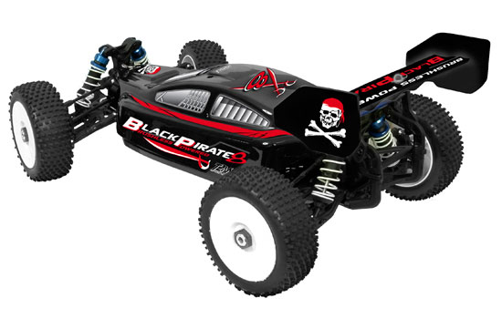

## Etudes de l'équilibre statique d'un véhicule sur roues

<!-- > Comme par exemple le véhicule de Course en cours ou le robot formateur EV3... -->

### Hypothèses

Le système admet un plan de symétrie $(O, \overrightarrow{x}, \overrightarrow{y})$. On considère donc que les actions mécaniques sur
les deux roues avant sont égales. De même pour les actions mécaniques sur les deux roues arrière. 

> Ce modèle peut donc s'appliquer également pour un deux roues ou un tricycle...

### Sur un sol plat

#### Modèle d'étude

##### Schéma

{.center width=50%}

<!-- {.center width=50%} -->

##### BAME (Bilan des Actions Mécaniques Extérieures)

{.center width=50%}

<!-- {.center width=50%} -->

??? abstract "Principe fondamental de la statique"

    Pour un solide en équilibre, la somme des Actions Mécaniques Extérieures (AME) au solide (S) est nulle :

    - la résultante est nulle $\sum\overrightarrow{F_{(AME \to S)}} = \overrightarrow{0}$
    - le moment résultant en un point (P) donné est nul $\sum\overrightarrow{M_{P(AME \to S)}} = \overrightarrow{0}$

??? tip "Calcul du moment d'une force"

    {.center width=50%}

    <!-- {.center width=50%} -->

##### Résolution

{.center width=90%}

<!-- {.center width=50%} -->

??? example "Application"

    {align=left width=30%}{align=right width=30%}
    **[T2M Buggy Black Pirate](http://www.t2m-rc.fr/de/modellbau-t2m-black-pirate-8-rtr-ohne-akku-T4903.html){target=_blank}**

    Le Black Pirate est un Buggy tout terrain 1/8, 4x4, 3 différentiels, à propulsion électrique Brushless.

    Sachant que la masse totale du buggy est $m = 3,60 kg$, déterminer la répartition de la charge initiale sur les roues arrière et avant lorsque le véhicule est à l’arrêt.
    
    {.center width=50%}

    {.center width=80%}
    
    
 

### Sur un sol en pente 

#### Modèle d'étude

##### Schéma

{.center width=60%}

<!-- {.center width=50%} -->

##### BAME (Bilan des Actions Mécaniques Extérieures)

{.center width=60%}

<!-- {.center width=50%} -->

??? abstract "Principe fondamental de la statique"

    Pour un solide en équilibre, la somme des Actions Mécaniques Extérieures (AME) au solide (S) est nulle :

    - la résultante est nulle $\sum\overrightarrow{F_{(AME \to S)}} = \overrightarrow{0}$
    - le moment résultant en un point (P) donné est nul $\sum\overrightarrow{M_{P(AME \to S)}} = \overrightarrow{0}$

??? abstract "Loi de Coulomb du Frottement (ou de l'adhérence) entre solides"

    [Animation (à télécharger sur PC)](./AnimationFrottement.zip)

    #### Modèle d'une caisse

    {.center width=60%}

    !!! note "Le coefficient de frottement :"

        - est indépendant de l’intensité de la force de contact (pression) .

        - est indépendant de l’étendue des surfaces de contact.

        - dépend uniquement de la nature des matériaux et de l’état de surfaces en contact.

    {.center width=90%}

    > Pour aller plus loin en [Tribologie](https://www.futura-sciences.com/sciences/dossiers/physique-matiere-materiaux-fait-monde-996/page/4/){target=_blank}

??? tip "Pourcentage d'une pente = tangente de l'angle"
    
    {.center width=50%}
    
##### Résolution

{.center width=90%}

{.center width=50%}

??? example "Application"

    {align=left width=30%}{align=right width=30%}
    **[T2M Buggy Black Pirate](http://www.t2m-rc.fr/de/modellbau-t2m-black-pirate-8-rtr-ohne-akku-T4903.html){target=_blank}**

    Sachant que le buggy de masse totale $m = 3,60 kg$ est sur une pente de 15% et que le frein parking est activé, déterminer la répartition de la charge initiale sur les roues arrière et avant lorsque le véhicule est à l’arrêt.  
    Quel est le coefficient d'adhérence minimale nécessaire au maintien en équilibre du buggy sur cette pente.
    
    {.center width=50%}
    
    {.center width=50%}

